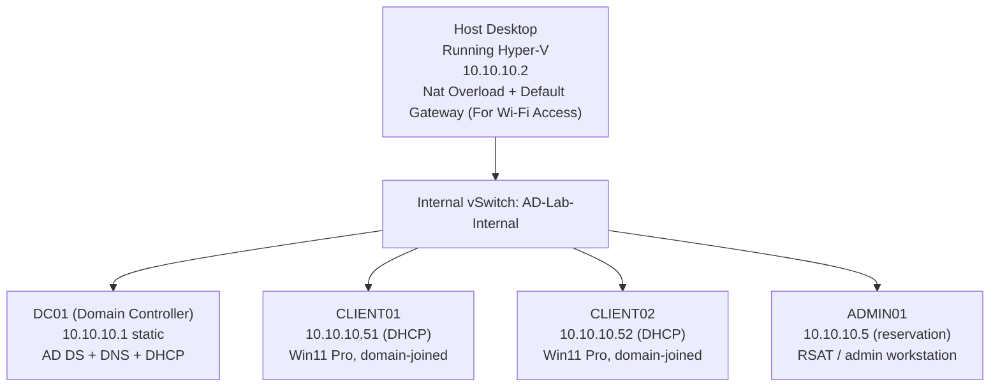
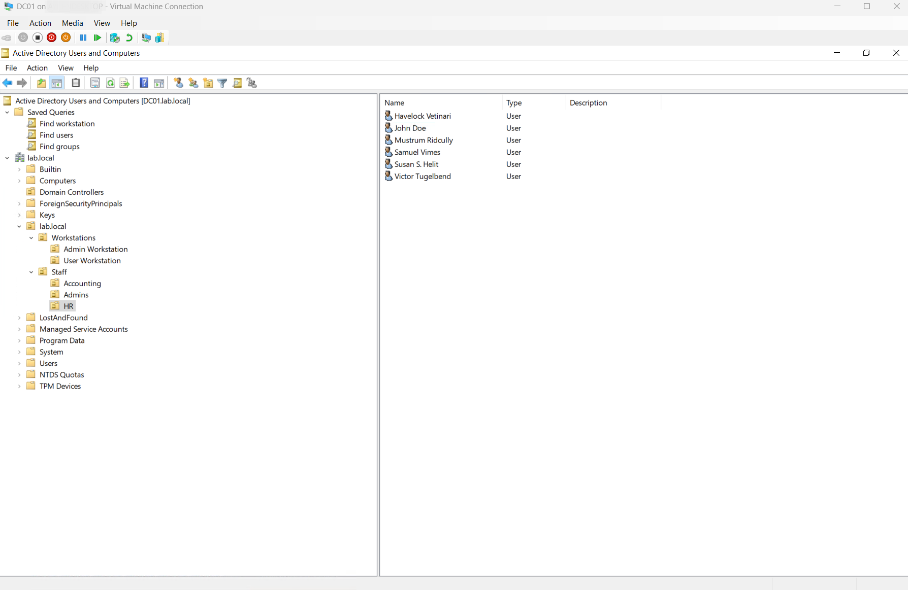
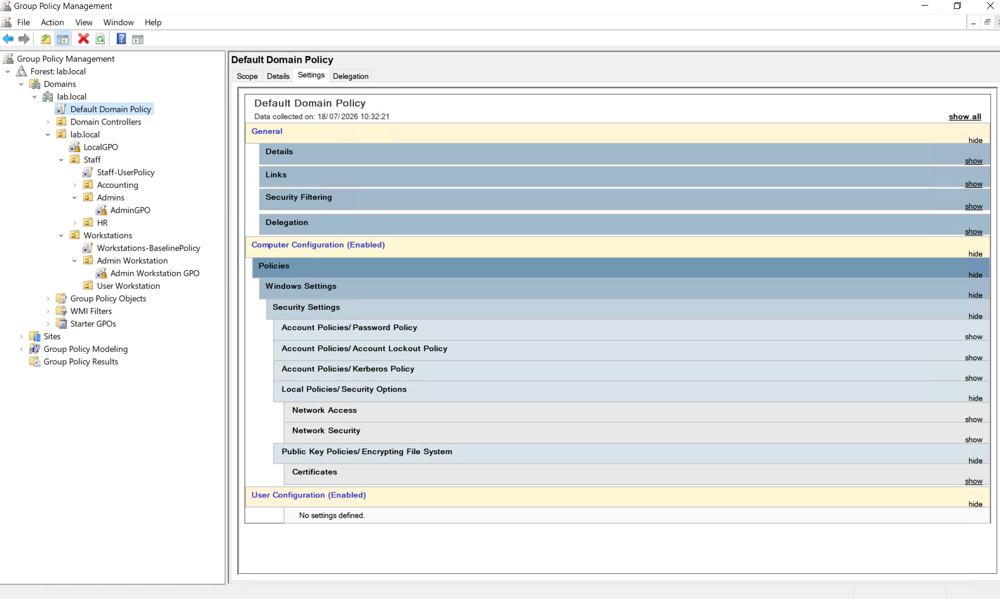
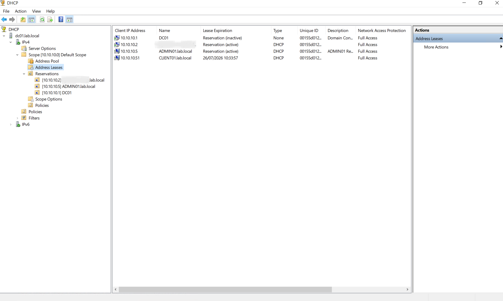
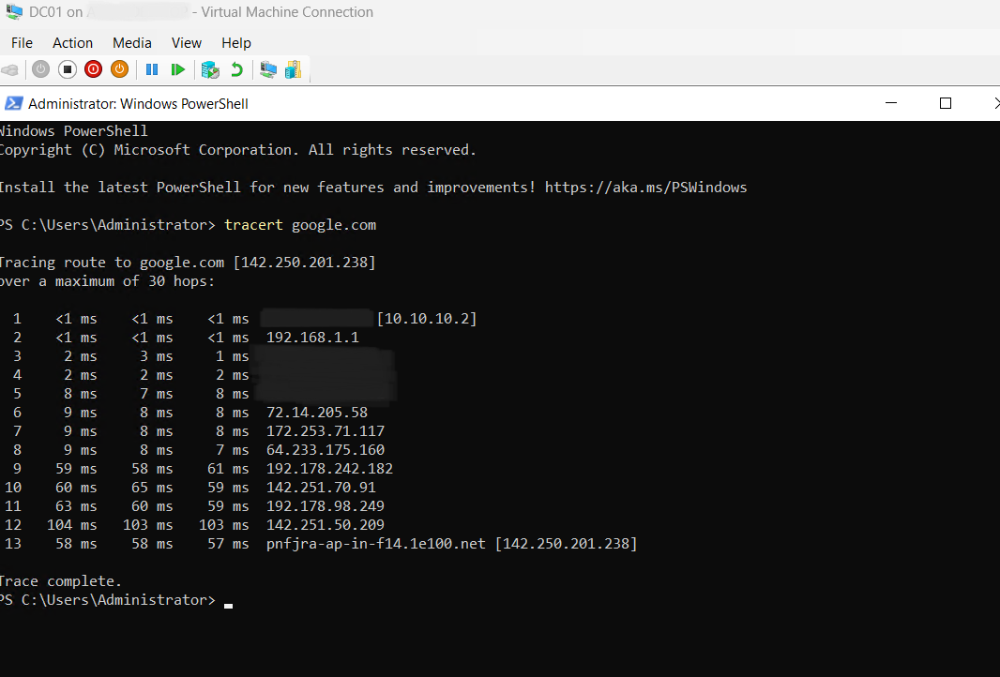
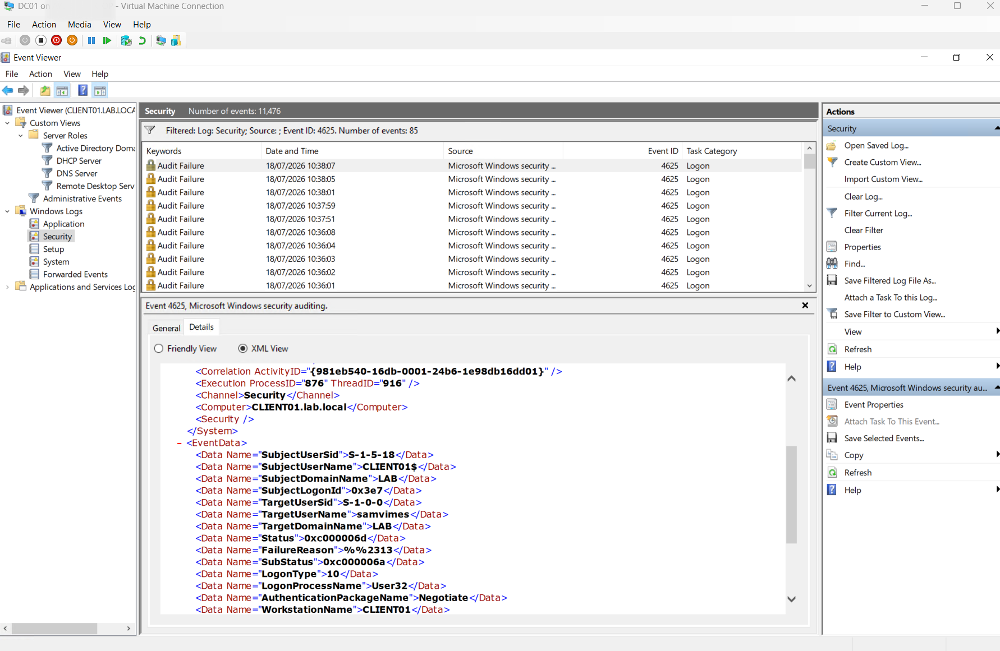

# Windows Active Directory Domain Services Homelab (Windows Server 2022)

A fully self-built on-premises Active Directory environment simulating a small business / MSP client network : Designed & Built on Hyper-V

**Goal:** Build the kind of environment a junior sysadmin or MSP support engineer would actually be handed | domain services, GPO management, least-privilege identity, DHCP/DNS, backup/recovery, and realistic helpdesk tickets | and resolve every issue through structured diagnosis rather than guesswork.

---

## Architecture

|Machine|Role|IP|Notes|
|---|---|---|---|
|DC01|Domain Controller, DNS, DHCP|10.10.10.1 (static)|Forest root, all FSMO roles|
|CLIENT01|Domain-joined Win11 Pro|10.10.10.51 (DHCP)|Rebuilt once after VHDX corruption|
|CLIENT02|Domain-joined Win11 Pro|10.10.10.52 (DHCP)|Functionally identical to CLIENT01|
|ADMIN01|RSAT admin workstation|10.10.10.5 (DHCP reservation)|Logon-locally restricted to admins only|
|Host|Hyper-V host / NAT gateway|10.10.10.2|Internal vSwitch only, isolated from physical LAN|

**Domain:** `lab.local` (NetBIOS `LAB`) | Windows Server 2022 Standard, Desktop Experience.

---

## Tools & Technologies

Hyper-V · Windows Server 2022 · Windows 11 Pro · Active Directory Domain Services · DNS · DHCP · Group Policy (GPMC/ADUC) · RSAT · NAT/PAT · Windows Server Backup · PowerShell

---

## Build Summary

**1. Core infrastructure** : Internal-type Hyper-V vSwitch (isolated from physical LAN), DC01 (Domain Controller) provisioned as Gen2 VM, promoted to forest root with AD DS + DNS.

**2. OU structure** : Staff / Servers / Workstations, designed to use computer-vs-user GPO targeting (the standard MSP delegation pattern).

**3. Client deployment** : CLIENT01/CLIENT02 domain-joined; recovered CLIENT01 from VHDX corruption via disk re-attachment.

**4. Least-privilege identity model** : Default Administrator account disabled. Two scoped groups built and permission-tested: a delegated admin group scoped to the Workstations OU (partial control), and a password-reset-only group scoped to Staff.

**5. Networking services** : DHCP scope with exclusion range for static reservations, scope options (router/DNS), NAT for outbound internet access, DNS forwarders, CNAME alias record.

**6. Remote administration** : RSAT deployed to ADMIN01; remote Event Viewer access enabled via custom firewall/COM+ GPO for remote log viewing & administration.

**7. Software deployment** : Firefox pushed via GPO software installation + startup scripts.

**8. Print services** | Shared printer via `FILE:` port + generic driver (no native Print-to-PDF sharing). Authenticated users can print; only Enterprise/Domain Admins manage printer configuration.

**9. Backup & recovery** : AD Recycle Bin enabled and tested (delete/restore). One-time System State backup executed and verified via `wbadmin get versions`.

**10. Remote access** : RDP fully resolved for both standard users and ADMIN01, including a Group Policy precedence conflict fix.

---

## Diagnostic Methodology

Every login/access issue was worked through the same triage sequence: rule out mundane user error first > check account state (enabled, expiry, lockout) > rule out GPO > isolate the actual root cause > remediate > verify the fix didn't introduce a new issue (e.g. confirming the account hadn't been locked as a side effect of the troubleshooting itself).

**"Can't log in"** : account state and GPO ruled out via `gpresult /r` before concluding it was a genuine credential issue; password reset with forced change at next logon.

**"Account locked out" message** : used remote Event Viewer access to read `Event ID 4625` directly on the client instead of manually checking AD fields. Sub Status `0xC000006A` (wrong password) vs. `0xC0000234` (actual lockout) distinguished the real cause before acting, avoiding an unnecessary unlock.

---

## Notable Troubleshooting (root-cause reasoning, not just fixes)

- **DNS forwarder test failures** traced to NAT not existing yet | forwarders were correctly configured, but there was no outbound path at all. Fixed by standing up NAT on the host.
- **A mapped network share worked before the host had an IPv4 address** on the internal interface | traced to Hyper-V auto-assigning IPv6 link-local addresses regardless of IPv4 state, which SMB used transparently.
- **RDP failure** traced to a Group Policy precedence conflict between two linked policies, resolved by adjusting priority so the correct policy's settings took effect | not a permissions or firewall issue as initially suspected.
- **VHDX corruption** on CLIENT01 : suspected cause: an improper dismount during a host to VM file transfer. Resolved by removing and re-attaching the disk reference rather than a full rebuild; root cause not independently confirmed.

---

## Skills Demonstrated

Active Directory architecture (forest/domain/OU design) · Group Policy design & troubleshooting (LSDOU precedence, Enforce vs. inheritance) · DNS/DHCP administration · Least-privilege / delegated access design · Kerberos & NTLM authentication concepts · Windows Firewall & remote management configuration · NAT/routing fundamentals · Backup fundamentals (System State backup execution, AD Recycle Bin restore tested) · Print services administration · Structured incident diagnosis using Event Viewer · PowerShell (AD cmdlets, networking cmdlets, Hyper-V management)

---

##Screenshots

