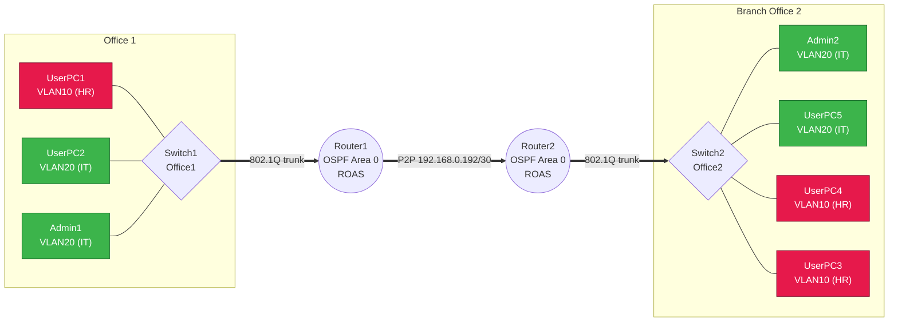
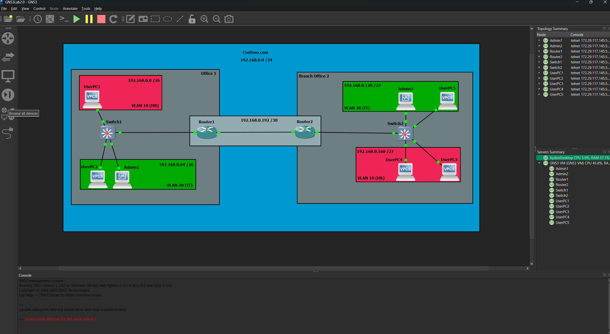
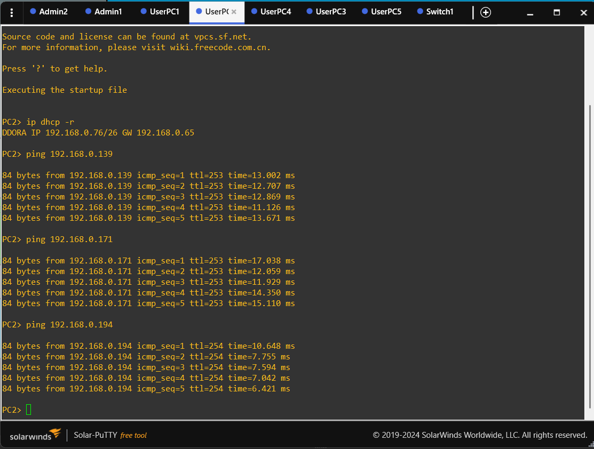
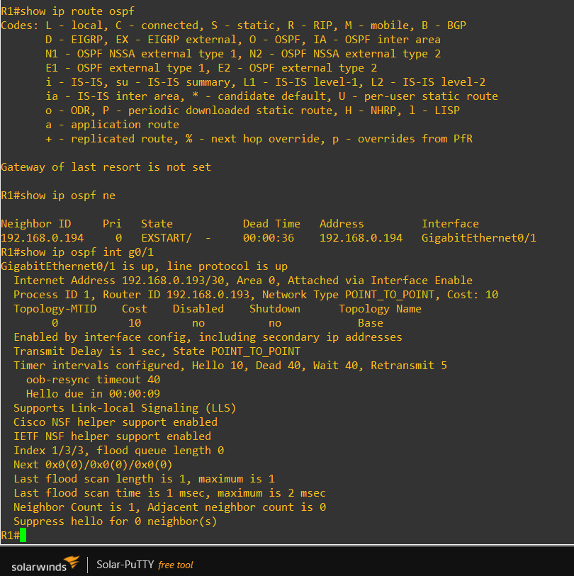
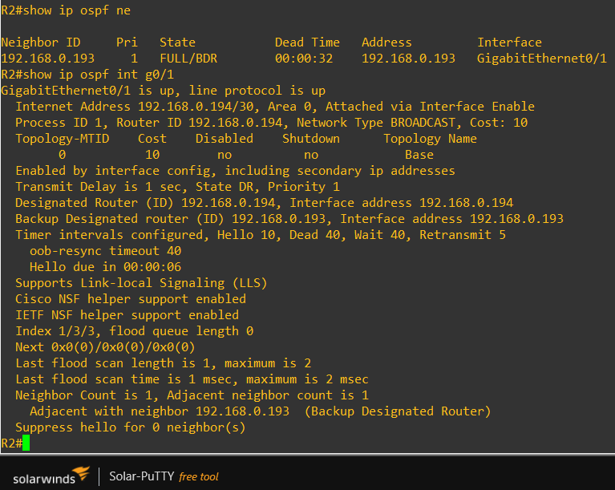
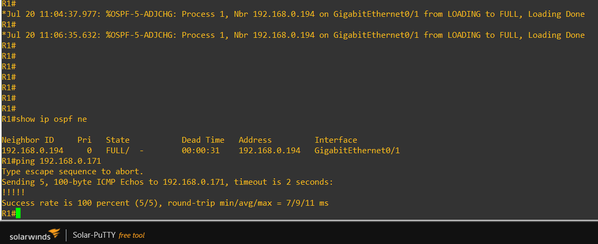
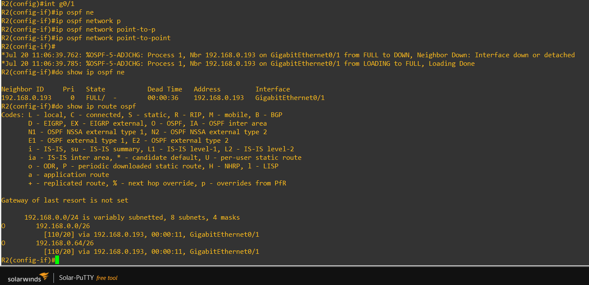
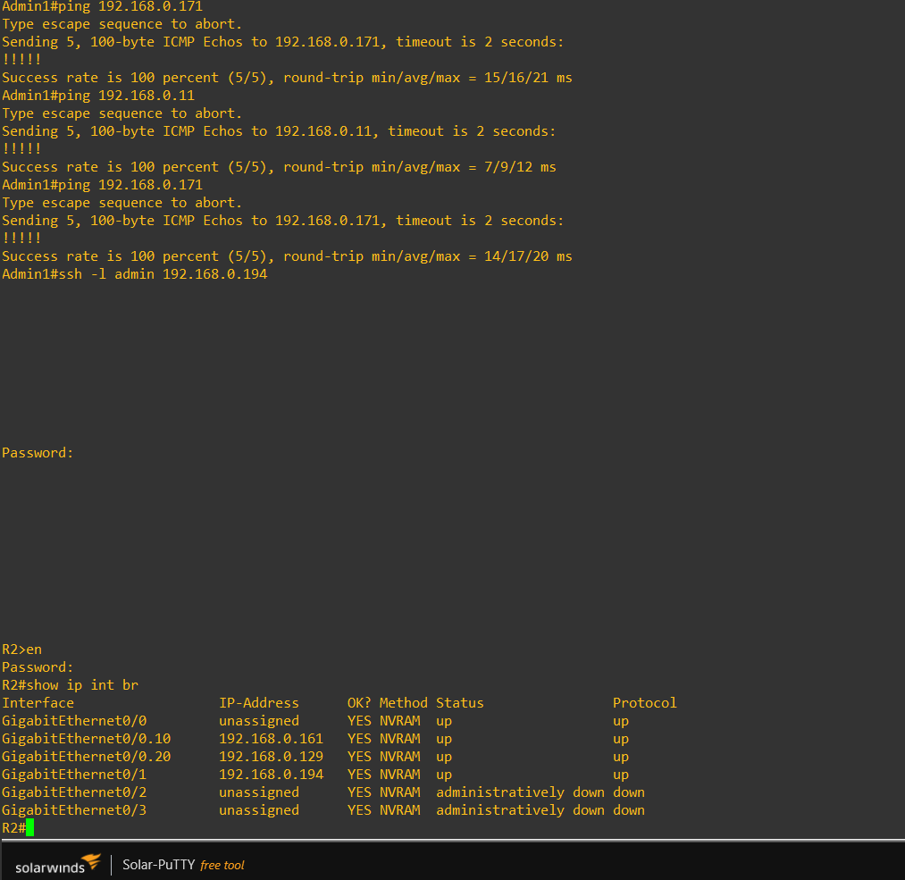
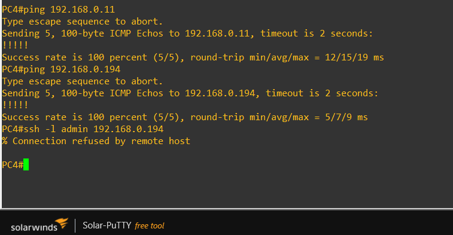
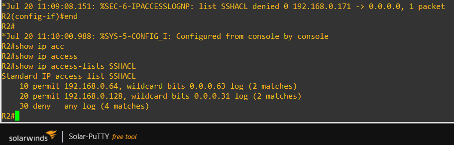

# Multi-Site Routing & Switching Lab (GNS3)

## Goal

Two-site routed and switched network for a fictional company (Contoso).
Built in GNS3 to practice VLSM subnetting, VLAN segmentation, router-on-a-stick inter-VLAN routing, DHCP, single-area OSPF, and ACL-restricted SSH management access.

## Design Decisions
 -  GNS3 isolated VM used instead of a local installation for better stability and resource management.
 -  R2 Configured with SSH to allow maintenance from main office
 -  Single OSPF area used to keep routing simple for a small enterprise.
 -  VLSM allocated according to expected departmental growth rather than equal subnet sizing.
## Architecture

| Site     | VLAN    | Subnet           | Gateway               |
| -------- | ------- | ---------------- | --------------------- |
| Office 1 | 10 (HR) | 192.168.0.0/26   | .1                    |
| Office 1 | 20 (IT) | 192.168.0.64/26  | .65                   |
| Office 2 | 10 (HR) | 192.168.0.160/27 | .161                  |
| Office 2 | 20 (IT) | 192.168.0.128/27 | .129                  |
| R1 - R2  | -       | 192.168.0.192/30 | .193 (R1) / .194 (R2) |

Single 192.168.0.0/24 for the whole company, Office 1 was allocated /26 networks while Office 2 received /27 networks to reflect differing host requirements while conserving address space.

Built and run in GNS3 (Hyper-V-hosted GNS3 VM).

## Build Summary

1. **Environment** : GNS3 client on the Hyper-V host, GNS3 VM (Hyper-V-native engine) imported and connected.
2. **Addressing** : Single /24 for both sites, VLSM used to provision addresses based on site needs.
3. **VLANs & trunking** : VLAN10 (HR) / VLAN20 (IT) per site, access ports per department, 802.1Q trunk from each switch to its own local router only; no switch-to-switch link.
4. **Inter-VLAN routing** : Router-on-a-stick subinterfaces on R1 and R2, one subinterface per local VLAN.
5. **DHCP** : Per-VLAN pools on each router, exclusion range covering the first 10 addresses of each subnet, 8-day lease; verified by clients successfully obtaining leases.
6. **OSPF** : Single area 0, passive on user-facing interfaces to suppress unnecessary hello traffic, active on the R1-R2 link with the network type set to point-to-point to match the actual link topology.
7. **SSH management access** : RSA 2048-bit keys, SSHv2 only, local authentication, VTY-applied standard ACL restricting SSH to the IT VLAN at both offices.
8. **Verification** : Full inter- and intra-office connectivity, OSPF adjacency FULL with all four VLAN subnets present in each routing table, SSH permit/deny behavior confirmed from live hosts in both VLANs.

## Diagnostic Methodology

Every issue was approached the same way: confirm Layer 1/2 state (interface up, correct VLAN/trunk) before assuming a Layer 3 or protocol-level misconfiguration. When 2 devices cant communicate, compare their state side by side & confirm the fix didn't introduce a new problem elsewhere.

## Notable Troubleshooting

**OSPF adjacency stuck below FULL** : network type mismatch.  `show ip ospf interface` showed R1 configured as `POINT_TO_POINT`, while R2 was still using the default `BROADCAST` network type. Matching the setting on R2 brought the adjacency to FULL immediately; `show ip route` on both routers then showed all four VLAN subnets present.

**DHCP requests stuck on Discovery : Initially suspected a DHCP scope issue. The actual problem was that the router subinterface was administratively down, so DHCP requests never reached the server. `no shutdown` resolved it.

**RSA key generation failed on R2.** `crypto key generate rsa` requires both hostname and `ip domain-name` set first. neither was configured yet. Set `ip domain-name lab.local`, then generated a 2048-bit key pair.

**GNS3 VM setup**. import script failed writing to `C:\Windows\System32` (wrong working directory, not a permissions bug); GNS3 VM initially got no IP address because the hand-built Hyper-V switch had no DHCP server on it, resolved by attaching to Hyper-V's built-in Default Switch instead.

## Skills Demonstrated

VLSM subnetting & CIDR design · VLAN segmentation & 802.1Q trunking · Router-on-a-stick inter-VLAN routing · DHCP scope/pool configuration · OSPF single-area configuration & adjacency troubleshooting · Standard ACL design for management-plane access control · SSH hardening (RSA keys, protocol version, local authentication) · Structured, comparative troubleshooting methodology · GNS3/Hyper-V lab platform administration

## What's Next

 -  Site-to-site VPN 
 -  Centralised Syslog 
 -  SNMP monitoring 
 -  Network Time Protocol 
## Screenshots

### Topology

### Ping verification

### OSPF Errors (R1 + R2)

### OSPF Fix Verification

### SSH Success (IT VLAN)

### SSH Denied (HR VLAN)

### SSH Log

